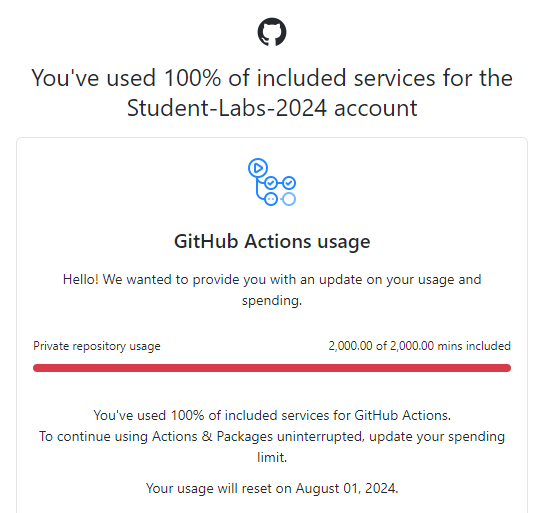

# Что произошло
23.07.2023 мы получили сообщение о том, что лимиты на запуск GitHub Actions закончились:



Грустная новость, но непреодолимых проблем в лабе нет. Теперь у нас свой раннер, на своём сервере, очень быстрый.

# Как исправить

Нужно исправить(добавить) одну строчку в ваших конфигах пайплайнов.

Например, было:
```
...
jobs:
  build:

    runs-on: ubuntu-latest

    steps:
    - uses: actions/checkout@v1
...
```

Стало:
```
...
jobs:
  build:

    runs-on: self-hosted

    steps:
    - uses: actions/checkout@v1
...
```
Ещё раз, нужно сделать вот так: `runs-on: self-hosted`

Пример можете найти в этом репозитории, файл `.github/workflows/integrate.yml`

После этого всё будет запускаться на нашем новом раннере.

Всем плодотворной работы!


